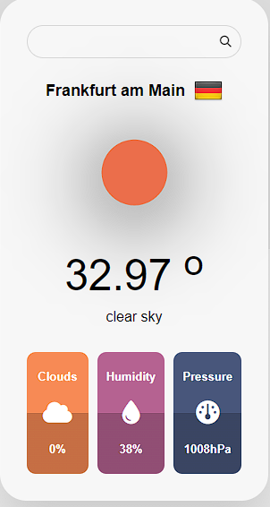

# Weather App

A simple weather app that fetches and displays weather information using the OpenWeatherMap API. Built with HTML, CSS, and JavaScript.

## Features

- **Search for Weather**: Enter a city name to fetch and display current weather information.
- **Weather Details**: View temperature, weather description, cloudiness, humidity, and pressure.
- **Responsive Design**: Clean and user-friendly interface with responsive design.

## Technologies Used

- **HTML**: Structure of the app.
- **CSS**: Styling and layout.
- **JavaScript**: Logic for fetching weather data and handling user interactions.
- **OpenWeatherMap API**: Provides weather data.

## How to Use

1. **Open the App**: Open `index.html` in a web browser.
2. **Search Weather**: Enter a city name in the search box and press the search button.
3. **View Results**: Weather information for the city will be displayed including temperature, description, clouds, humidity, and pressure.

## Files

- **`index.html`**: The main HTML file containing the app structure.
- **`style.css`**: The CSS file for styling the app.
- **`app.js`**: The JavaScript file for handling weather data and interactions.

## Screenshots



## How to Run Locally

1. Clone the repository:

   ```bash
   git clone https://github.com/Adlichalbi/WeatherApp.git
   ```
2. Navigate to the project directory:
```bash
    cd WeatherApp
```  

3. Open `index.html` in a web browser:

Simply double-click the index.html file or open it using your preferred browser.

## API Key

Replace `1a667dfd59c0d47857b5e92a4fc03854` in app.js with your own [OpenWeatherMap](https://openweathermap.org/) API key for personal use.
I'm Only providing you my Api key to test the app , in a real world scenario no one should publish API Key publicly

## Contributing
If you would like to contribute to this project, please fork the repository and submit a pull request. You can also open an issue to report bugs or request features.
## License
This project is licensed under the MIT License.
## Contact
For questions or feedback, feel free to reach out to Adli Chalbi.